<!DOCTYPE html>
<html lang="es">
<head>
  <meta charset="UTF-8">
  <title>Interacciones con imágenes</title>
  <meta name="viewport" content="width=device-width, initial-scale=1.0">

  
</head>

<body>

<main>

  <!-- SECCIÓN: BIENVENIDA -->
  <section id="bienvenida" class="screen active">
    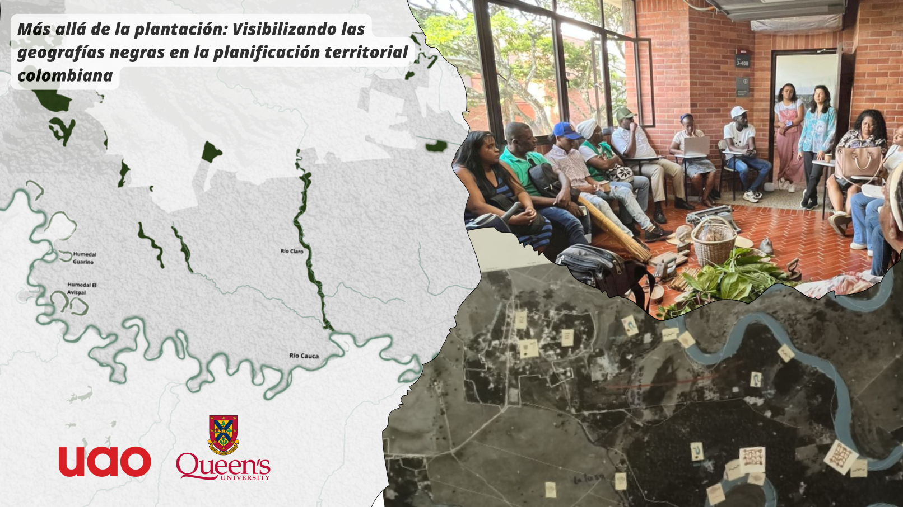

    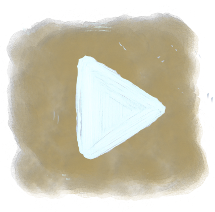
  </section>

  <!-- SECCIÓN: INTRODUCCIÓN -->
  <section id="introduccion" class="screen">
    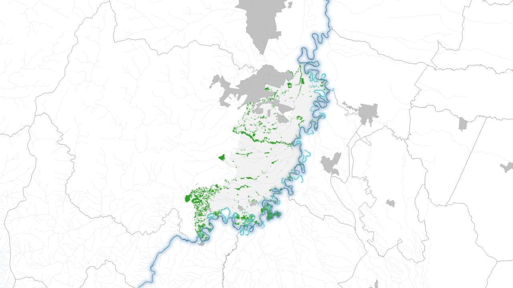

    

      <!-- GRUPO DE 3 BOTONES -->
      

        

          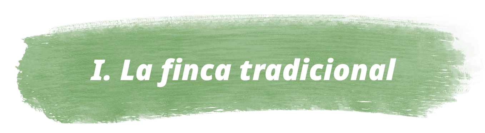
          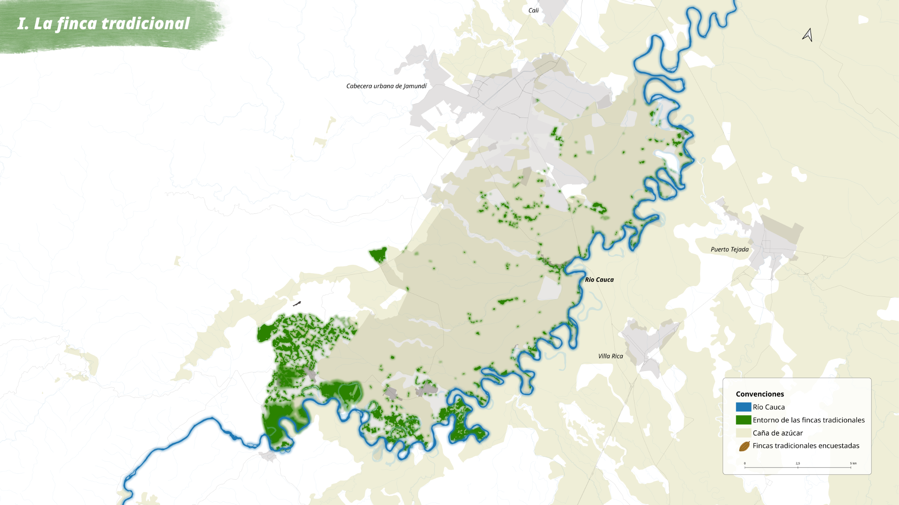
        

        

          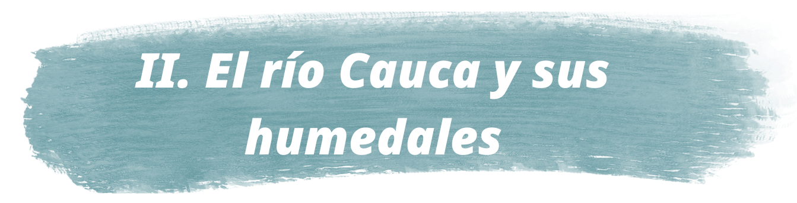
          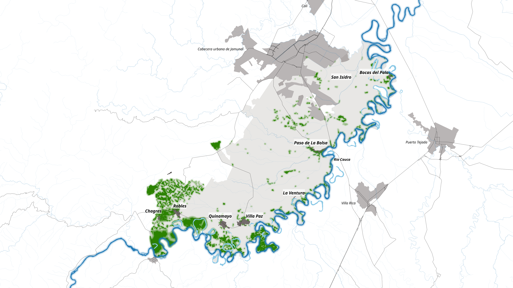
        

        

          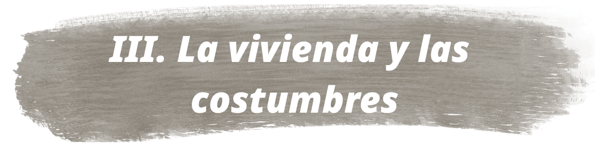
          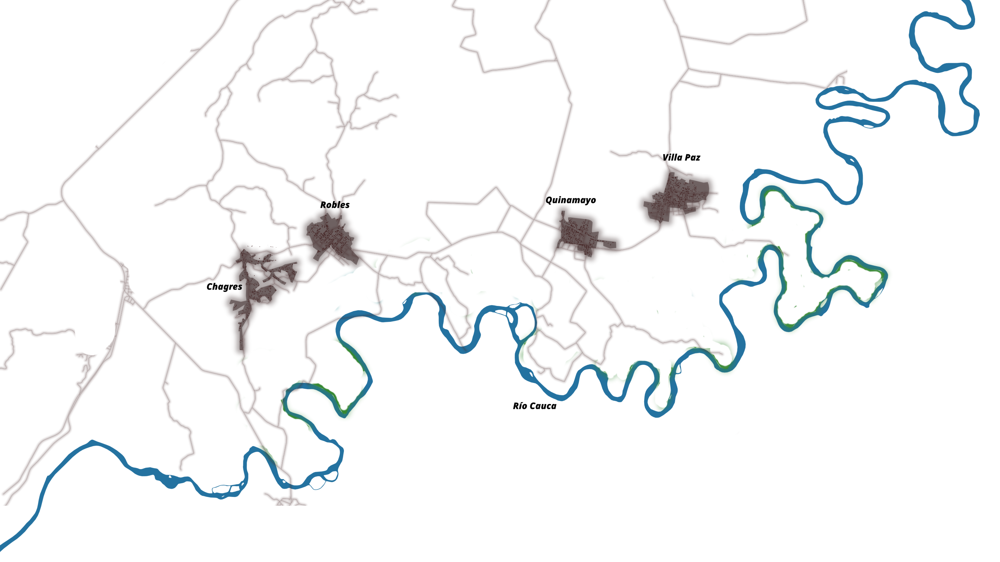
        

      

      <!-- BOTÓN TALLERES INDEPENDIENTE -->
      

        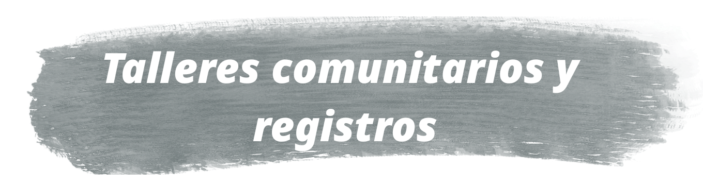
        
      

    

  </section>

  <!-- SECCIONES INTERNAS -->
  <section id="finca" class="screen">
    

    <!-- CAPA DE PUNTOS PARPADEANDO -->
    

    <!-- ⭐ CAPAS QUE SE PRENDEN Y APAGAN (ajusta los nombres de archivo) -->
    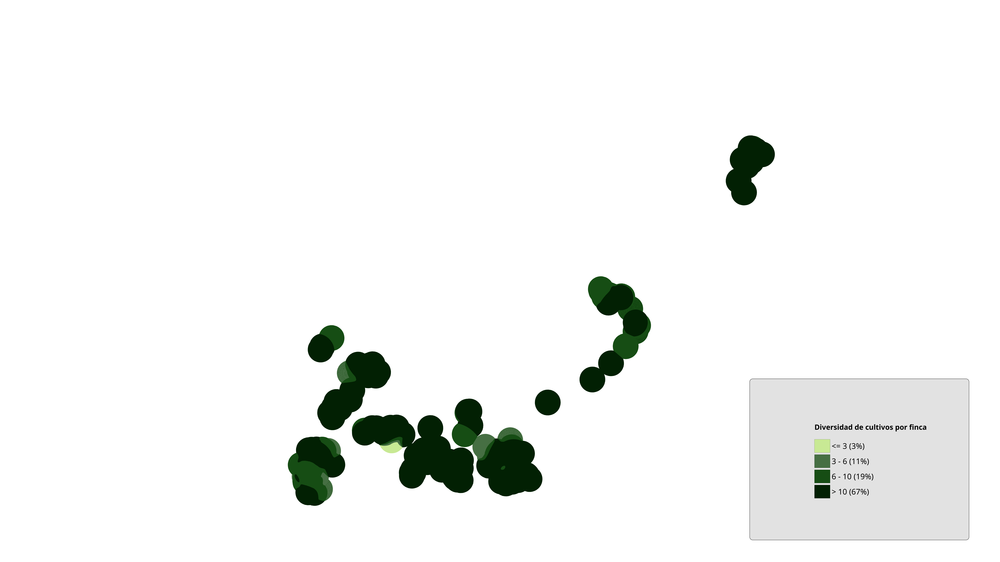

    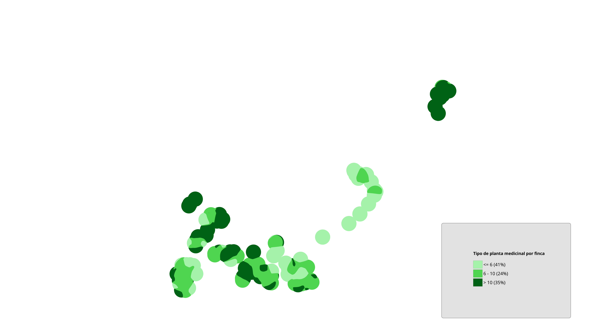

    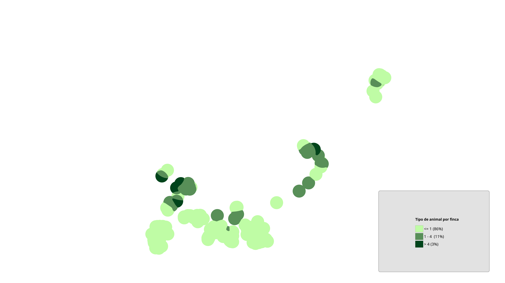

    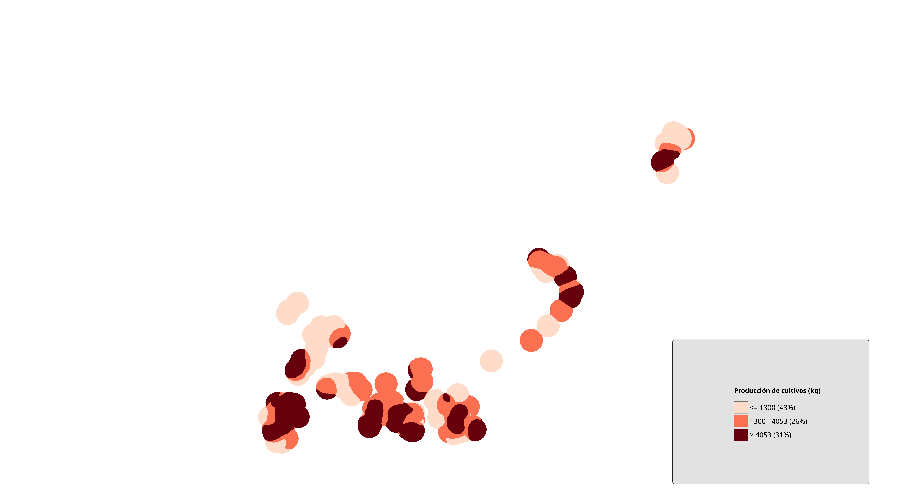

    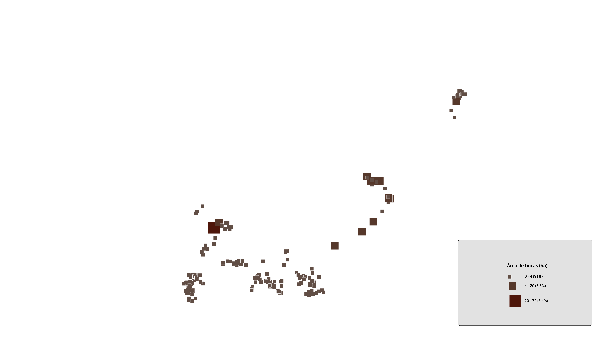

    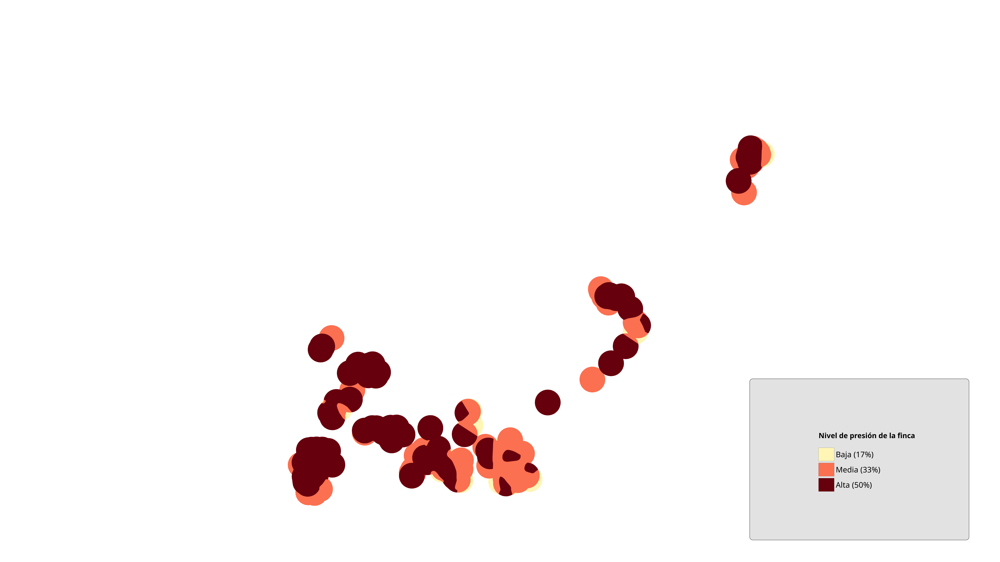

    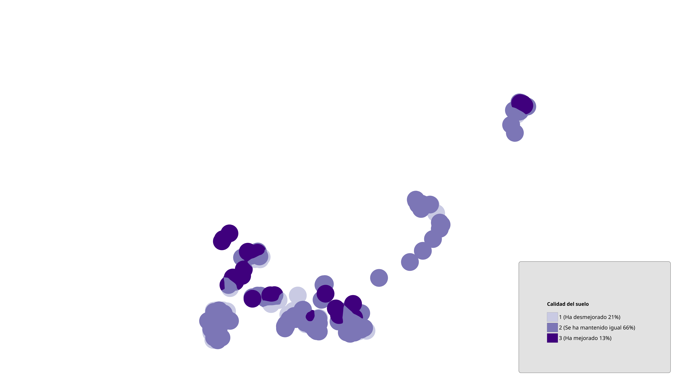

    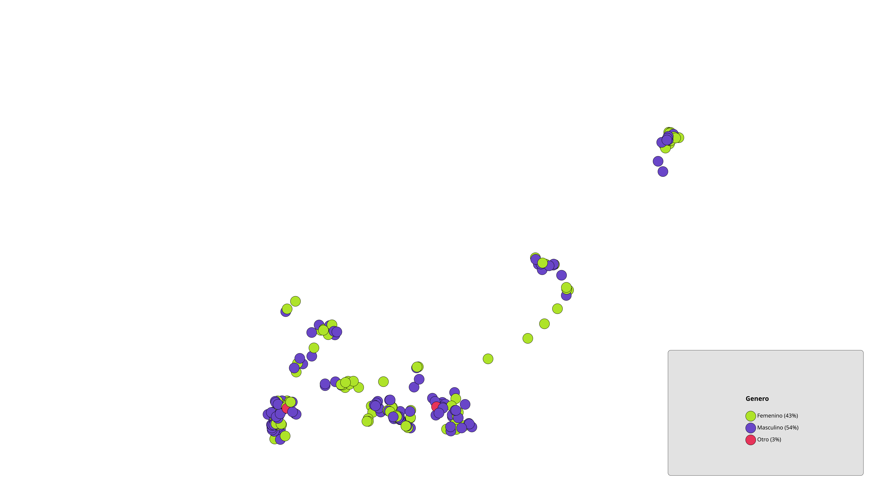

    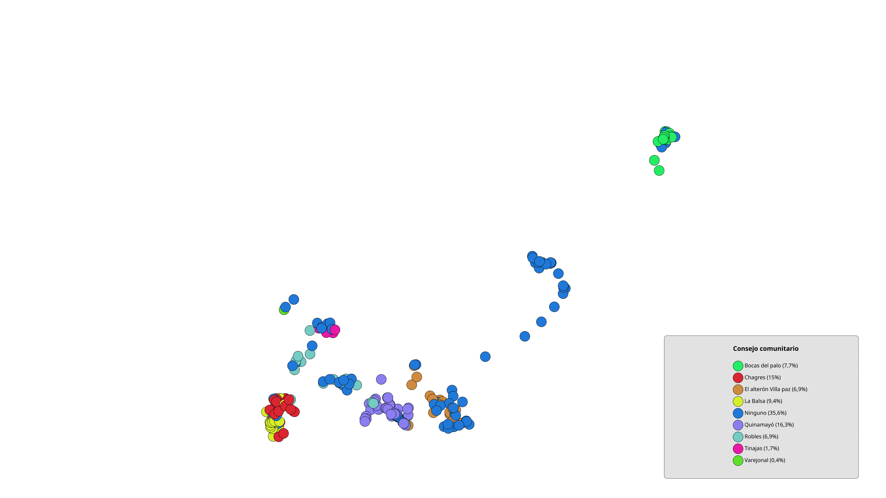

    <!-- PANEL DE BOTONES PARA PRENDER/APAGAR -->
    

      <button class="layer-toggle-btn" data-layer-target="cultivos">
        1. Cultivos por finca
      </button>
      <button class="layer-toggle-btn" data-layer-target="plantas">
        2. Plantas medicinales por finca
      </button>
      <button class="layer-toggle-btn" data-layer-target="animales">
        3. Animales por finca
      </button>
      <button class="layer-toggle-btn" data-layer-target="prod_agricola">
        4. Producción agrícola por finca
      </button>
      <button class="layer-toggle-btn" data-layer-target="area">
        5. Área de las fincas
      </button>
      <button class="layer-toggle-btn" data-layer-target="afectaciones">
        6. Afectaciones de la finca
      </button>
      <button class="layer-toggle-btn" data-layer-target="prod_animal">
        7. Calidad del suelo
      </button>
      <button class="layer-toggle-btn" data-layer-target="genero">
        8. Género del dueñ@
      </button>
      <button class="layer-toggle-btn" data-layer-target="consejo">
        9. Pertenencia a consejo comunitario
      </button>
    

    <!-- ⭐ BOTONES DE CONSEJOS (MÓVILES POR top/left) -->
    <button
      class="consejo-btn consejo-bocas"
      data-img="consejo1.png">
      Bocas del Palo
    </button>

    <button
      class="consejo-btn consejo-robles"
      data-img="consejo2.png">
      Robles
    </button>

    <button
      class="consejo-btn consejo-villapaz"
      data-img="consejo3.png">
      Villa Paz
    </button>

    <button
      class="consejo-btn consejo-chagres"
      data-img="consejo4.png">
      Chagres
    </button>

    <button
      class="consejo-btn consejo-quinamayo"
      data-img="consejo5.png">
      Quinamayo
    </button>

    <button
      class="consejo-btn consejo-laventura"
      data-img="consejo6.png">
      La Ventura
    </button>

    <button
      class="consejo-btn consejo-paso"
      data-img="consejo7.png">
      Paso de La Bolsa
    </button>

    <button
      class="consejo-btn consejo-sanisidro"
      data-img="consejo8.png">
      San Isidro
    </button>

    <button
      class="consejo-btn consejo-varejonal"
      data-img="consejo9.png">
      Varejonal
    </button>

    <!-- MODAL REUTILIZABLE PARA TODOS LOS CONSEJOS -->
    

      

        
        <button class="modal-close" type="button">Cerrar</button>
      

    

    <button class="back-btn nav-btn" data-target="#introduccion">⬅ Volver</button>
  </section>

  <section id="humedales" class="screen">
    

    <!-- BOTÓN: FINCA TRADICIONAL Y EROSIÓN DEL RÍO -->
    <button
      class="rio-finca-btn"
      type="button"
      id="btn-rio-finca">
      FINCA TRADICIONAL Y EROSIÓN DEL RÍO
    </button>

    <!-- MODAL PARA LA IMAGEN DE FINCA TRADICIONAL Y EROSIÓN DEL RÍO -->
    

      

        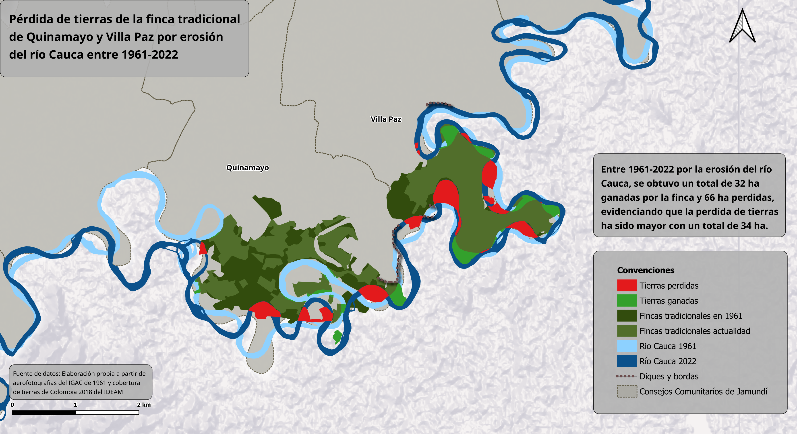
        <button class="modal-close" type="button">Cerrar</button>
      

    

    <button class="back-btn nav-btn" data-target="#introduccion">⬅ Volver</button>
  </section>

  <section id="vivienda" class="screen">
    
    <button class="back-btn nav-btn" data-target="#introduccion">⬅ Volver</button>
  </section>

  <section id="talleres" class="screen">
    
    <button class="back-btn nav-btn" data-target="#introduccion">⬅ Volver</button>
  </section>

</main>

</body>
</html>
